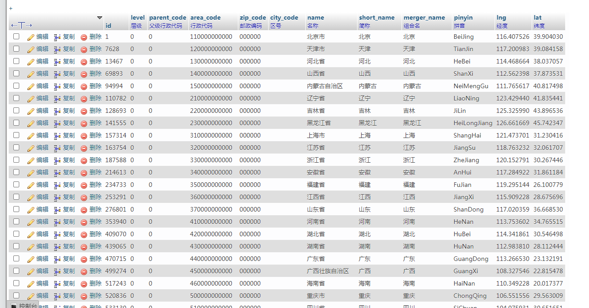

# 中国省市区街村五级联动MySQL库
<div align="center">
    <code></code>
    </br></br>
    <code><a href="https://www.iiylw.com"></a></code>
    <code></code>
    <code></code>
    </br></br>
    <code></code></br></br>
    <code><a href="https://gitee.com/xchsdo"></a></code>
    <code><a href="https://github.com/xchsdo"></a></code>
    <code><a href="https://gitlab.com/xchsdo"></a></code>
    </br></br>
    <code><a href="https://github.com/xchsdo/cnarea"></a></code>
    <code><a href="https://github.com/xchsdo/cnarea"></a></code>
    <code><a href="https://github.com/xchsdo/cnarea"></a></code>
    <code><a href="https://github.com/xchsdo/cnarea"></a></code>
    <code><a href="https://github.com/xchsdo/cnarea"></a></code>
    </br></br>
    <code><a href="https://github.com/xchsdo/cnarea/blob/master/LICENSE"></a></code>
</div>

### 介绍
* 基于 `PHP + jQuery + Ajax + MySQL` 省市县镇村五级联动
* 爬取国家统计局官网的行政区域数据
* 大陆地区: 省市县镇村5个层级, 以及 邮政编码、简称、组合名、拼音名称、经纬度等信息
* 港澳地区: 省市县三级联动, 台湾地区: 省市县镇四级联动

### 数据来源
* 集成数据库来源
    * [china_area_mysql](https://github.com/kakuilan/china_area_mysql) (发布时间: 2020-07-06)
* 集成数据库已更新至
    * [2020年统计用区划代码和城乡划分代码(截止时间: 2020-06-30)](http://www.stats.gov.cn/tjsj/tjbz/tjyqhdmhcxhfdm/2020/index.html)
* 民政部、国家统计局
    * [中华人民共和国民政部-中华人民共和国行政区划代码](http://www.mca.gov.cn/article/sj/xzqh/)
    * [中华人民共和国国家统计局-统计用区划和城乡划分代码](http://www.stats.gov.cn/tjsj/tjbz/tjyqhdmhcxhfdm/)
    * [中华人民共和国国家统计局-统计用区划代码和城乡划分代码编制规则](http://www.stats.gov.cn/tjsj/tjbz/200911/t20091125_8667.html)

---------------------------------------
### 软件架构

    ┌─api                     应用目录
    │  ├─api.php              api函数文件 (如修改过数据库表名称, 修改文件内的 cnarea_2020 为修改后的表名称)
    │  ├─common.inc.php       数据库配置文件 (自行修改)
    │  └─mysqli.php           数据库连接文件
    │
    ├─assets                  资源目录
    │  └─js                   js目录
    │     └─index.js          js配置文件
    │
    ├─database                数据库目录
    │  ├─cnarea20200630.7z    数据库文件, 导入数据中 (爬取2020年数据, 截止2020年6月30日)
    │  ├─database.png         数据库演示图
    │  └─README.md            数据库 README 文件
    │
    ├─extension               扩展目录
    │  ├─frequency.php        PHP基于Redis检测用户接口访问频率
    │  ├─token.php            演示 tokenbucket.php 令牌加入与消耗
    │  └─tokenbucket.php      PHP基于Redis使用令牌桶算法实现接口限流
    │
    ├─index.html              演示入口文件
    ├─LICENSE.txt             授权说明文件
    └─README.md               README 文件

### 安装教程
1. git https://github.com/xchsdo/cnarea.git
2. running index.html

### 已实现功能
1. 前后端
    1. 支持 php5.6 - 8.0
    2. 支持 api 进行 post & get
    3. 包含大陆地区的邮政编码和经纬度信息
    4. 支持 大陆地区: 省市县镇村5级联动, 港澳地区: 省市县3级联动, 台湾地区: 省市县镇4级联动
2. 数据库 共 **758049** 条
    > [./database/cnarea20200630.7z](./database/cnarea20200630.7z): 爬取2020年的数据, 截止2020年6月30日.
    1. 大陆数据共 **679237** 条
        1. 省/直辖市 `31`
        2. 市/州 `342`
        3. 县/区 `3348`
        4. 乡/镇 `42757`
        5. 村/社区 `632759`
    2. 港澳台数据共 **78812** 条
        1. 省/特区 `3`
        1. 港澳辖区 `33`
        2. 台湾市/县 `23`
        3. 台湾区/镇 `371`
        4. 台湾街道/村 `78384`
    3. 改动:
        1. 2020比2019的数据少了25513条记录
        2. 具体说明见 [#56](https://github.com/kakuilan/china_area_mysql/issues/56)

### 数据库表结构
```mysql
CREATE TABLE `cnarea_2020` (
    `id` mediumint(7) unsigned NOT NULL AUTO_INCREMENT,
    `level` tinyint(1) unsigned NOT NULL COMMENT '层级',
    `parent_code` bigint(14) unsigned NOT NULL DEFAULT '0' COMMENT '父级行政代码',
    `area_code` bigint(14) unsigned NOT NULL DEFAULT '0' COMMENT '行政代码',
    `zip_code` mediumint(6) unsigned zerofill NOT NULL DEFAULT '000000' COMMENT '邮政编码',
    `city_code` char(6) NOT NULL DEFAULT '' COMMENT '区号',
    `name` varchar(50) NOT NULL DEFAULT '' COMMENT '名称',
    `short_name` varchar(50) NOT NULL DEFAULT '' COMMENT '简称',
    `merger_name` varchar(50) NOT NULL DEFAULT '' COMMENT '组合名',
    `pinyin` varchar(30) NOT NULL DEFAULT '' COMMENT '拼音',
    `lng` decimal(10,6) NOT NULL DEFAULT '0.000000' COMMENT '经度',
    `lat` decimal(10,6) NOT NULL DEFAULT '0.000000' COMMENT '纬度',
    PRIMARY KEY (`id`),
    UNIQUE KEY `uk_code` (`area_code`) USING BTREE,
    KEY `idx_parent_code` (`parent_code`) USING BTREE
) ENGINE=MyISAM DEFAULT CHARSET=utf8 COMMENT='中国行政地区表';
```


### 许可说明
This repo is released under the [WTFPL](./LICENSE) – Do What the Fuck You Want to Public License.